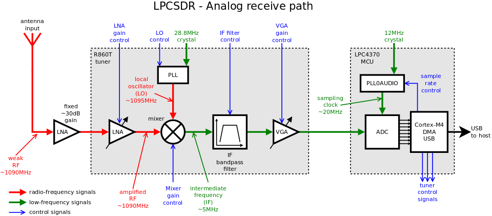
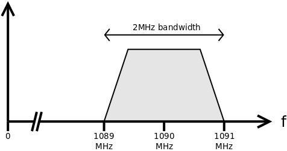
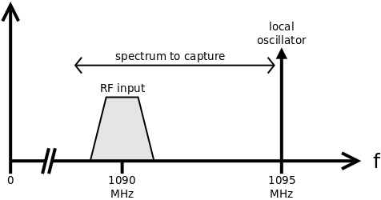
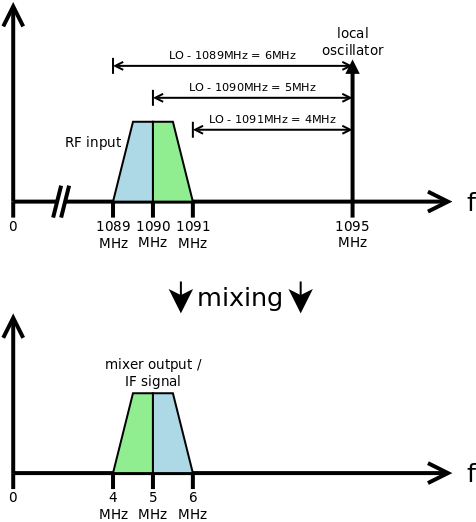
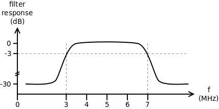
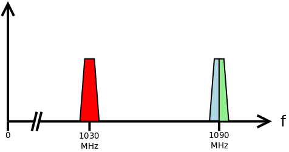
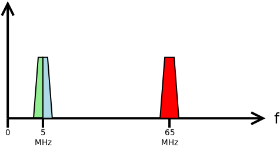
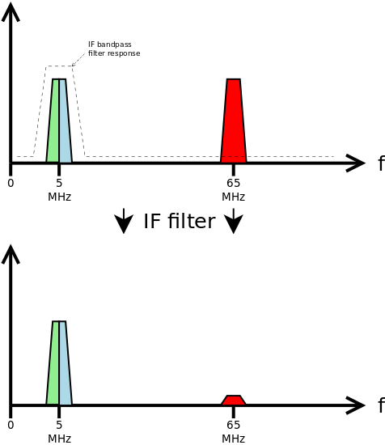
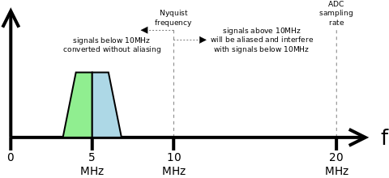

# Analog receive path

This document discusses the analog side of the LPCSDR hardware. The analog
side is the parts of the hardware that are dealing with signals as physical,
continuously-varying, voltages. At the end of the analog path, we sample and
measure that physical signal voltage using an ADC, and processing continues
on the digital side where signals are represented as a series of discrete
sample values with limited precision.

Here's a high-level view of the analog side of the LPCSDR hardware:

The following sections walk through the analog receive path, starting from the
antenna input and working towards the ADC that converts data into a digital
form.

This explanation uses a 1090MHz signal to illustrate, but the same
general process applies to any sort of signal handled by the LPCSDR.

## RF input

The input signal that we want to capture is a weak signal centered around
1090MHz, with about 2MHz of bandwidth. That is, we want to capture the signal
between about 1089MHz and about 1091MHz:

The signal received at the antenna input is extremely weak. A good signal level
here might be -50dBm = 0.00001mW of received power.

## What are we trying to do here?

The analog receive path is trying to do three things:

 * Extract just the interesting part of the input signal (i.e. 1089-1091MHz).
   The antenna will pick up many other signals that we don't care about -- as
   far as possible, discard those.
 * Amplify the signal to a level where it is strong enough that the ADC can
   digitize it effectively. Try not to add noise or amplify parts of the signal
   we don't want.
 * Shift the interesting part of the input signal down to a lower frequency, so
   we can digitize and process it at that lower frequency. This is useful
   because higher frequencies would need a (much) higher ADC sampling rate and
   (much) more processing power on the digital side.

## Fixed LNA

The very first thing we do is feed this weak signal through a low noise
amplifier (LNA), a separate discrete component on the LPCSDR PCB. This initial
LNA has a fixed gain of about 30dB and is quite broadband -- it just amplifies
everything it receives regardless of frequency.

## Tuner LNA

Next, we feed the amplified RF input into the R860T tuner. Internally, this
signal goes to a second LNA. This LNA is variable-gain, the amount of
amplification it applies is configurable (16 steps, configurable over I2C).

At this point, the signal still looks essentially the same as the signal
received by the antenna, just amplified.

## Tuner mixer and LO

The actual "tuning" part of the tuner happens in the tuner's mixer. The mixer
receives the amplified input:

It combines this RF input with a local oscillator (LO) signal. The LO is a
single-frequency signal that has a frequency near one edge of the part of the
input spectrum that we want to capture.

The LO is generated by a phase-locked-loop (PLL) within the tuner that uses
the 28.8MHz crystal input as a reference, and scales it up by a configurable
(over I2C) ratio to generate the LO signal that we want. 

In this case, where we want to capture a signal near 1090MHz, we might set the
LO to 1095MHz:

The internals of how this mixer is implemented are entirely undocumented, but
the net effect is that the mixer outputs a frequency-shifted version of the
input signal, where $f_{mixer} = f_{LO} - f_{RF}$. That is, it will produce a
*mirrored* version of the part of the input signal immediately below $f_{LO}$:

Because we chose $f_{LO} = \mathrm{1095MHz}$, our input signal at
1089MHz..1091MHz will end up centered at 5MHz, with frequencies around that
center frequency mirrored.

For example, if there was some RF input at 1089MHz - the low edge of our
input signal - then the corresponding mixer output is at
$`f_{mixer} = f_{LO} - f_{RF}
  = \mathrm{1095MHz} - \mathrm{1089MHz}
  = \mathrm{6MHz}`$.
If there was some RF input at 1091MHz, the corresponding mixer output is at
$`f_{mixer} = f_{LO} - f_{RF}
  = \mathrm{1095MHz} - \mathrm{1091MHz}
  = \mathrm{4MHz}`$.

So our signal of interest now lies between 4MHz..6MHz, and the low and high
ends of the frequency range have been mirrored.

This is the *intermediate frequency* (IF) signal and it is this signal
that we will (after some more filtering) digitize with the ADC.

## Tuner mixer gain

As part of the mixing process, the mixer amplifies the signal further by a
configurable amount -- this is the mixer gain. Again, this gain setting is
configurable in 16 steps over I2C.

## Tuner IF filter

The tuner provides a configurable-over-I2C bandpass filter that is applied
to the mixer output. This filter lets us select just the part of the output
that has the signal that we want, and attenuate any other nearby signals that
may have made it this far. The filter passes only signals with frequencies
between a configurable low and high cutoff. In our example, we are only
interested in the part of the I2C signal between 4MHz..6MHz, so
we might set the bandpass range to (for example) 3MHz..7MHz:

Let's say that our RF input has actually also picked up some signal at 1030MHz,
which is the frequency used for Mode S interrogations sent by SSRs:

With $f_{LO} = \mathrm{1095MHz}$, the signal at
$f_{RF} = \mathrm{1030MHz}$ will appear in the mixer output at
$`f_{mixer} = f_{LO} - f_{RF}
  = \mathrm{1095MHz} - \mathrm{1030MHz}
  = \mathrm{65MHz}`$,
in addition to the signal we actually wanted at 5MHz:

Without further filtering, this 65MHz signal will interfere when we later try
to digitize the signal, as it is above the Nyquist frequency for our ADC
sampling rate and will be aliased on top of the signal we actually care about.
Applying the tuner IF filter with a bandpass range of 3MHz..7MHz, this
extraneous 65MHz input can be removed:

## Final tuner amplifier

Finally, the tuner has a third configurable amplifier, the "VGA" (variable-gain
amplifier), which can provide additional amplification of the mixer output if
needed.

## Tuner to ADC

The tuner's IF output is connected to the LPC's ADC input.

The tuner output is a differential output with a peak-to-peak range of about
5.5V, but the LPC's ADC input expects a differential input with a peak-to-peak
range of about 0.8V. We scale the tuner output through a simple voltage
divider to bring it into the range that the ADC expects

There are some simulations of the scaling effect of this divider available
[in the circuit-sim directory](../circuit-sim/README.md).

## LPC ADC conversion

Finally, we are ready to convert the amplified, downshifted, filtered signal
from analog voltages to digital values for further processing by the host.
This conversion is done by a high-speed ADC ("ADCHS" in the LPC docs)
which samples the tuner's output at a configurable rate, and measures the
signal voltage at each sample as a signed 12-bit value (i.e. a number in
the range -2048 .. +2047).

To usefully convert the IF signal, we need to sample it at a rate that is
at least twice the highest frequency component of the input signal (the
[Nyquist rate](https://en.wikipedia.org/wiki/Nyquist_rate)). Any higher
frequency components present in the input will end up being aliased, as if
they were actually at a lower frequency, and we want to minimize this because
it will interfere with the signal we're actually trying to hear. With an
appropriately configured IF bandpass filter, we have already eliminated most
of these higher frequencies (with one exception - see the discussion of 12MHz
spurs below)

In our example, our IF signal is mostly contained between 4MHz-6MHz, and we've
applied a bandpass filter that passes 3MHz-7MHz. So we need a sampling rate
of _at least_ 7MHz*2 = 14MHz to capture all the detail of that 7MHz component.

In practice, we actually aim for a sampling rate that is exactly 4x the center
frequency of the signal we're measuring, because that makes later (digital)
processing much easier. In this case, that would be 5MHz * 4 = 20MHz,
comfortably greater than the minimum sampling rate required.

The sampling rate is controlled by a separate clock that is sent to the ADCHS
internally within the LPC chip. We generate this clock by configuring one of
the LPC's internal PLLs (PLL0AUDIO) to generate the sampling rate we want,
using an external 12MHz crystal as the reference frequency and scaling that
to the rate we need.

## 12MHz spurs in conversion

The real world is not quite as perfect as the theory. One quirk we observe is
that the 12MHz signal from the LPC's crystal leaks into the ADC input quite
strongly, somewhere internally within the LPC itself. So, regardless of how
well we condition the ADC input signal, there's always a stray 12MHz signal
added in to it.

This causes problems because that 12MHz spur will appear *somewhere* in the
ADC data that we capture, and if we are not careful it might appear right on
top of the real signal we're trying to capture due to [aliasing](https://en.wikipedia.org/wiki/Aliasing#Sampling_sinusoidal_functions).

We can predict where the 12MHz spur will appear. For sampling rates above
24MHz, it would appear at 12MHz -- but actually, we never sample at such a high
rate, so that's not an interesting case.

For some lower sampling rate $f_s$, the spur will appear at:

$$
\mathrm{spur}(f_s) =
\begin{cases}
  \mathrm{12MHz} \bmod f_s & {\mathrm{12MHz} \bmod f_s} < {F_s/2} \\
  f_s - {\mathrm{12MHz} \bmod f_s} & \mathrm{otherwise}
\end{cases}
$$

For example, at a sampling rate of $f_s = 5\mathrm{MHz}$:

 * $`\mathrm{spur}(f_s)
   = \mathrm{12MHz} \bmod f_s
   = \mathrm{12MHz} \bmod \mathrm{5MHz}
   = \mathrm{2MHz}`$
 * $\mathrm{2MHz} < {f_s/2}$, so the spur appears at 2MHz

At a sampling rate of $f_s = 7.5\mathrm{MHz}$:

 * $`\mathrm{spur}(f_s)
   = \mathrm{12MHz} \bmod f_s
   = \mathrm{12MHz} \bmod \mathrm{7.5MHz}
   = \mathrm{4.5MHz}`$
 * $\mathrm{4.5MHz} > {f_s/2}$, so the spur appears at
   $`f_s - \mathrm{12MHz} \bmod f_s
   = \mathrm{7.5MHz} - \mathrm{4.5MHz}
   = \mathrm{3MHz}`$

If that spur lies somewhere within our signal of interest, we're going to
have a problem.

In our earlier example, $f_s = 20MHz$, so $\mathrm{spur}(x) = \mathrm{8MHz}$,
luckily not within our signal of interest at 4MHz..6MHz. The digital side will
need to deal with that 8MHz signal somehow, but it can be safely filtered out
without impacting the main signal.

## Avoiding 12MHz spurs

There are two ways to ensure that the spur never lands on our signal:

### Choose a safe sampling rate

Some sampling rates put the spur right at the edge of the captured spectrum,
where there will be no useful signal. These rates are where
$f_s = \mathrm{24MHz} / N, N = 2,3,...$ :

 * 12MHz (spur at 0)
 * 8MHz (spur at 4MHz)
 * 6MHz (spur at 0)
 * 4.8MHz (spur at 2.4MHz)
 * 4MHz (spur at 0)
 * 3.43MHz (spur at 1.71MHz)
 * 3MHz (spur at 0)
 * etc.

Other sampling rates close to these will put the spur close to the edge of
the captured spectrum, which may be acceptable.

### Double the sampling rate and exclude half the spectrum

Let's say we want to capture 3.5MHz worth of spectrum at 1090MHz - 1093.5MHz,
using a sampling rate of 7MHz. We tune the tuner LO to 1093.5MHz, producing
an IF signal between 3.5MHz..0Hz.

The 12MHz spur will appear at 2MHz, right in the middle of our signal.

To avoid this, we could instead:

 * Use a sampling rate of 14MHz, capturing an IF signal between 0 - 7MHz
 * This sampling rate also produces a spur at 2MHz
 * Tune the LO to 1097MHz. Our IF now represents the spectrum from
   1097MHz..1090MHz. Our signal at 1090MHz..1093.5MHz now appears between
   7MHz..3.5MHz, avoiding the spur at 2MHz
 * On the digital side, we can do some filtering and frequency shifting to
   remove the 2MHz spur and shift the received signal back to where the
   client is expecting it to be

More generally, by doubling the sampling rate, we capture twice the bandwidth.
As the spur will only appear at one frequency, it can, at worst, only
affect signals in one half of that doubled bandwidth, and so we can arrange
for our actual signal to appear in the other half.

This approach does rapidly run into sampling-rate limits, as we're limited
to capturing about 5MHz of spur-free sbandwidth (i.e. 20MHz ADC sampling rate,
after the sample rate doubling)

This approach could be made more general at the expense of considerably more
work on the digital side -- pick the next highest "safe" sampling rate, and
then do sample rate conversion.
