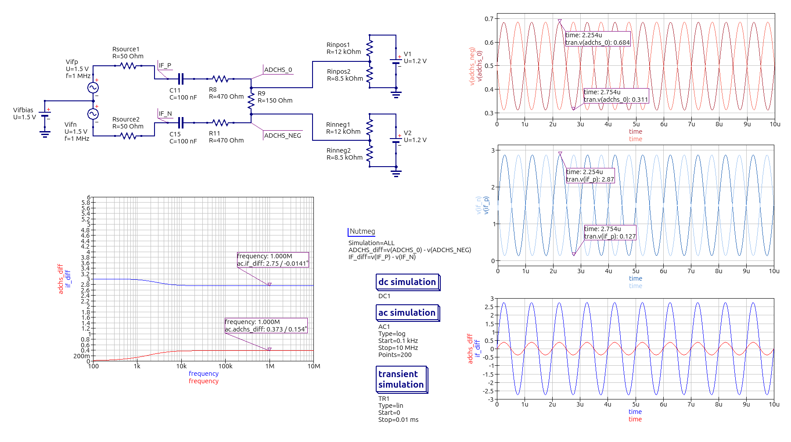

# IF/ADC simulation

This is a simulation of the tuner IF -> ADC input part of the LPCSDR.

[Input schematic](lpcsdr-if-adc.sch) --
load this into [qucs-s](https://ra3xdh.github.io/) for simulation

[Results as PDF](lpcsdr-if-adc.pdf) --
vector format, so a bit cleaner than the image below

Results as a raster image:

